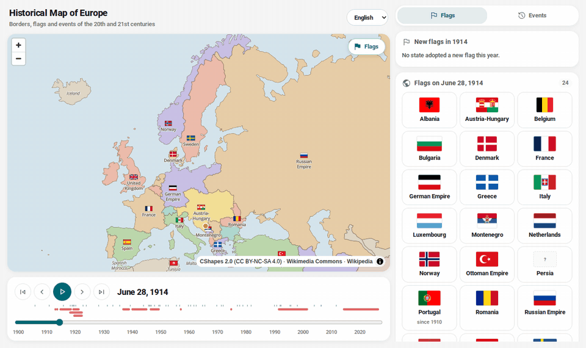
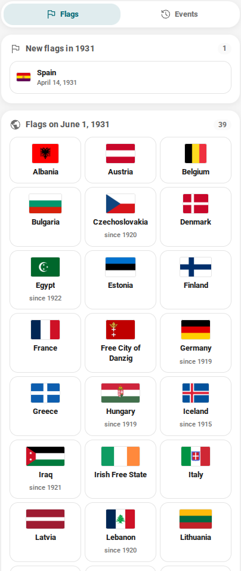
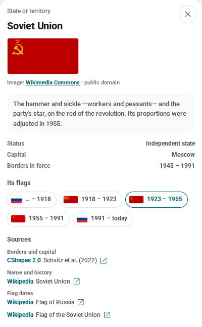
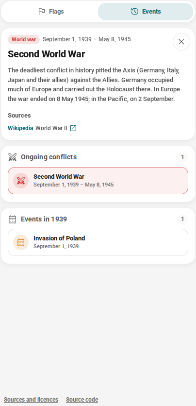
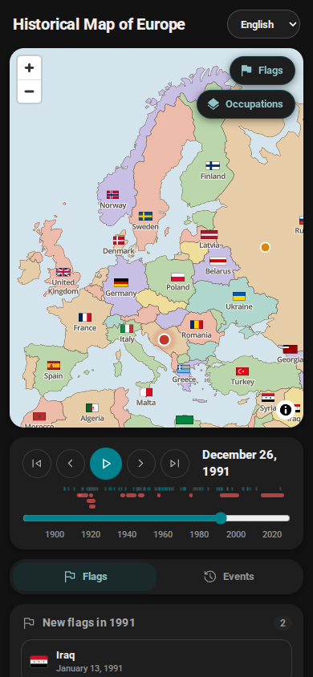
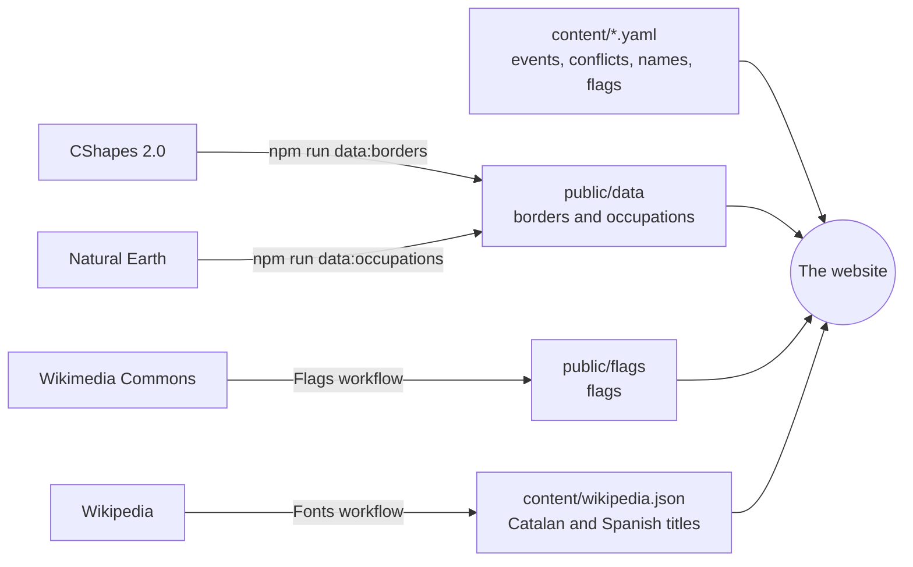

<div align="center">

# Historical Map of Europe

**Europe from 1500 to today, on a map that moves: the borders, the flags and what happened.**

[Open the map](https://arnaum13.github.io/history-map/?lang=en) · [Where the information comes from](DADES.en.md) · [Contributing](CONTRIBUTING.en.md) · [Roadmap (in Catalan)](FULL-DE-RUTA.md)

[Català](README.md) · [Castellano](README.es.md) · **English**

[](https://github.com/ArnauM13/history-map/actions/workflows/ci.yml)
[](https://github.com/ArnauM13/history-map/actions/workflows/sources.yml)
[](LICENSE)
[](content/README.md)
[](DADES.en.md)



</div>

Pick a date and the map shows you Europe on that day: which states existed and what they were
called, which flag each one flew, which wars were being fought and what happened that year. And,
for each of those, where it comes from.

The history of 20th-century Europe is usually told with four maps —1914, 1919, 1945 and 1991— and
whatever happens in between is left to the imagination. Between 1918 and 1922, for instance, the
map changes every few months. Here you can follow it day by day.

## What you'll find

| | |
| --- | --- |
| **The borders on any day** | From 1886 to today, with the exact day of every change and the name each state had at the time: the Russian Empire, Soviet Russia, the Soviet Union, Russia. |
| **Four more centuries** | From 1500 to 1885, year by year: the Kingdom of France and the July Monarchy, the Holy Roman Empire, the Polish-Lithuanian Commonwealth, the Swedish Empire. With the occupations the source counted as annexations given back to their owners, and the exact day of every change of regime. |
| **Every flag in its time** | About a hundred flags of some seventy states: on the map, in a gallery for each date and on each state's card, with what the ones with the most history mean. |
| **What happened at the same time** | Ongoing conflicts and the year's events, next to the map and marked on the timeline. |
| **Occupations, from 1938 to today** | What was controlled in practice and the borders don't show: the annexation of Austria, the General Government, Vichy France, Yugoslavia and Greece carved up, occupied Ukraine; and, since 2014, Crimea, the Donbas and the front of the Russo-Ukrainian war, phase by phase. In the occupier's colour, as one more part of its territory, and each zone with its name on the map and its own card. |
| **The source of every piece of data** | Every card says where its borders, name, flag dates and events come from, with the link to check it. |
| **Three languages** | Catalan, Spanish and English: the interface, the names of states and capitals, the texts and the Wikipedia links. |
| **A link for every date** | `?d=1914-06-28&lang=en` opens exactly the same map for whoever gets it. |

## Screenshots

<table>
  <tr>
    <td width="50%" valign="top">
      
      <p><b>Flags.</b> Every flag flying that day, and the ones adopted that year: in 1931, the Second Republic's.</p>
    </td>
    <td width="50%" valign="top">
      
      <p><b>A state's card.</b> The flag and what it means, every flag it has had and, under "Sources", where each piece of data comes from.</p>
    </td>
  </tr>
  <tr>
    <td valign="top">
      
      <p><b>Events, conflicts and occupations.</b> What was ongoing that day, what happened that year and who controlled each territory: in 1942, the General Government.</p>
    </td>
    <td valign="top">
      
      <p><b>On a phone, in dark mode.</b> The map, the timeline and the panel, one below the other.</p>
    </td>
  </tr>
</table>

## Where the information comes from

No piece of data gets in without a source, and the source is shown on the card where it appears.

| What you see | Where it comes from |
| --- | --- |
| Borders and capitals | [CShapes 2.0](https://icr.ethz.ch/data/cshapes/) (ETH Zurich and University of Konstanz), with the exact day of every change from 1886 to 2019 |
| Borders before 1886 | [Cliopatria](https://github.com/Seshat-Global-History-Databank/cliopatria) (Seshat Global History Databank), year by year, and, in central Europe from 1815 to 1870, [OpenHistoricalMap](https://www.openhistoricalmap.org/), with the day of every change; with the corrections explained in [DADES.en.md](DADES.en.md) |
| Each state's name in each period | A Wikipedia article for every name |
| Flag dates | The Wikipedia articles on each state's flags |
| Flag images | [Wikimedia Commons](https://commons.wikimedia.org/), with each one's licence and author |
| Events and conflicts | Wikipedia and external sources, such as UN resolution 68/262 on Crimea |
| Occupied and annexed zones | CShapes borders from other years, today's divisions from [Natural Earth](https://www.naturalearthdata.com/) hand-drawn lines and, in Ukraine, the [DeepStateMap](https://deepstatemap.live/) front line, with each zone's Wikipedia article |

The tests let nothing in without a source, and the "Fonts" workflow checks every Monday that all
articles and links still exist. The details, corrections and limitations are in
[DADES.en.md](DADES.en.md).

## What it doesn't do (on purpose)

- **It doesn't draw front lines, for now, except that of the Russo-Ukrainian war.** The occupations
  layer says who controlled each territory, not where the armies were. That is why occupied Russia
  is still missing: it changed hands with the front. In Ukraine, where the front has been moving
  since 2022, it goes in phases, each with the line of a given day.
- **It isn't an encyclopaedia.** Two or three sentences and the link to the source; the rest is
  well explained there.
- **It asks you for nothing.** No account, no cookies, no personal data.
- **It can't be used commercially.** The CShapes borders are CC BY-NC-SA.

## How it works

A static website: React 19, TypeScript, Vite and [MapLibre GL](https://maplibre.org/). No server,
no database. Each piece of border carries the day it starts and the day it ends, and showing the
map on a given day is a filter: `start <= day <= end`.



The content is YAML, read and written by hand and validated by the tests. External data (borders,
flags, Wikipedia titles) is downloaded by scripts, and on GitHub by workflows that commit it when
it changes.

## Running it

Requires Node.js 22 or newer.

```bash
git clone https://github.com/ArnauM13/history-map.git
cd history-map
npm install
npm run dev        # http://localhost:5173
```

| Command | What it does |
| --- | --- |
| `npm run dev` | Development server |
| `npm run build` | Type-checks and builds the site into `dist/` |
| `npm test` | The tests, which also validate all the content and its sources |
| `npm run lint` · `npm run format` | oxlint and Prettier |
| `npm run data:borders` | Rebuilds the borders from CShapes 2.0 |
| `npm run data:occupations` | Rebuilds the zones of the occupations layer |
| `npm run data:flags` | Downloads the flags listed in `content/flags.yaml` |
| `npm run data:sources` | Checks the sources and translates the Wikipedia titles |

## Structure

```
content/        the content: events, conflicts, occupations, state and capital names, flags (YAML)
public/data/    the borders and occupied zones, generated from CShapes
public/flags/   the flags, downloaded from Wikimedia Commons
scripts/        the ones that generate or check the data
src/            the website: the map, the timeline, the panel
```

How it's built and the conventions are in [CLAUDE.md](CLAUDE.md); the design, in
[DESIGN.md](DESIGN.md) (both in Catalan).

## Contributing

What it needs most is content: events, conflicts, flag dates. No programming required: it's a short
YAML file, and a source is mandatory. [CONTRIBUTING.en.md](CONTRIBUTING.en.md) explains how, and
the issues have templates to propose an event or report a border, a name or a flag that's wrong.
You can write in Catalan, Spanish or English.

## What's next

- **The rest of the occupations layer**: occupied Russia, with the front lines, and today's other
  disputed territories.
- **More content**: about a hundred events and thirty conflicts, with academic sources as well as
  Wikipedia.
- **Search and guided stories** that move the map step by step.

The rest is in [FULL-DE-RUTA.md](FULL-DE-RUTA.md) (in Catalan).

## Licences

| What | Licence |
| --- | --- |
| The code | [MIT](LICENSE) |
| The texts in `content/` | [CC BY-SA 4.0](content/README.md) |
| The borders and occupations in `public/data/` | CC BY-NC-SA 4.0, like CShapes 2.0: **non-commercial use only** |
| The flags in `public/flags/` | Each image's own, almost all public domain (`credits.json`) |
| Fonts and icons | Open Sans and Material Symbols (Apache 2.0), Roboto (OFL 1.1) |

## Acknowledgements

- Guy Schvitz, Luc Girardin, Seraina Rüegger, Nils B. Weidmann, Lars-Erik Cederman and Kristian
  Skrede Gleditsch, for [CShapes 2.0](https://icr.ethz.ch/data/cshapes/).
- Everyone who draws flags on Wikimedia Commons and writes Wikipedia, in every language.
- [Natural Earth](https://www.naturalearthdata.com/), for the administrative divisions.
- [DeepStateMap](https://deepstatemap.live/), for the front line of the Russo-Ukrainian war.
- [MapLibre](https://maplibre.org/), [OpenMapTiles](https://github.com/openmaptiles/fonts),
  [Fontsource](https://fontsource.org/) and [Material Symbols](https://fonts.google.com/icons).
- The visual language comes from Petja.
