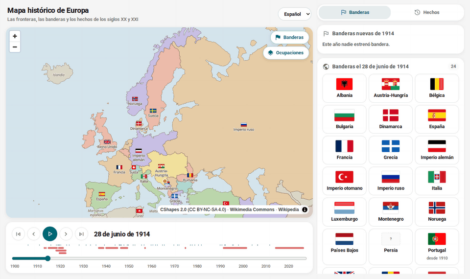
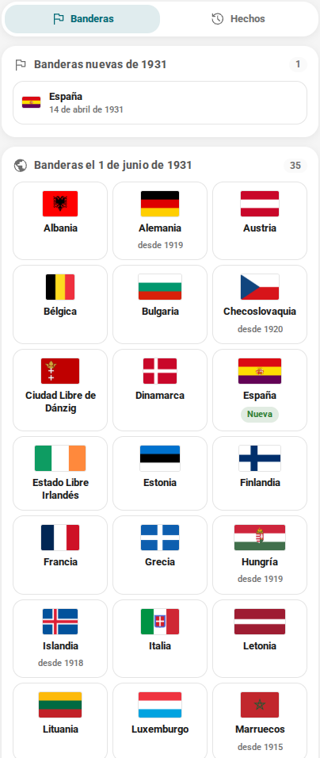
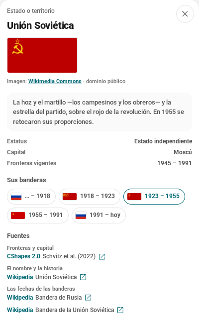
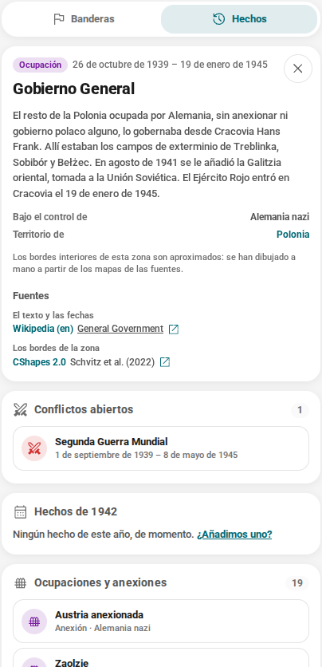
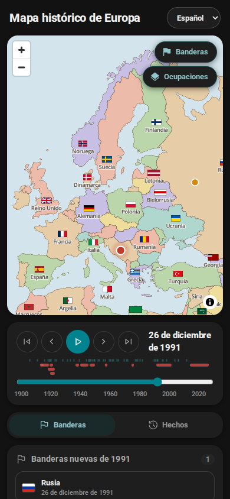
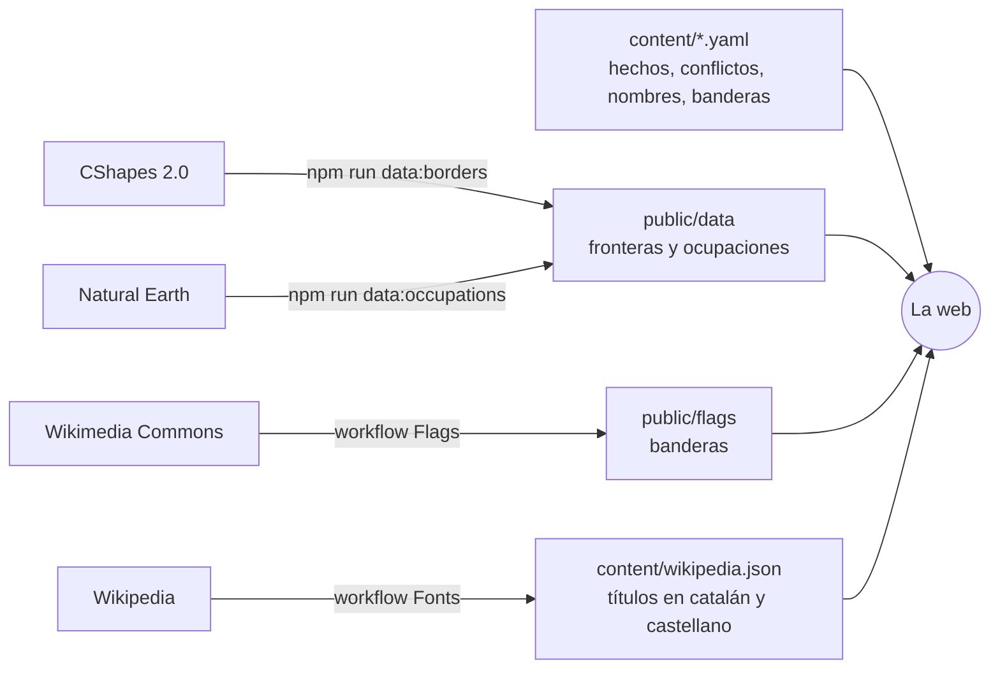

<div align="center">

# Mapa histórico de Europa

**Europa de 1886 a hoy, en un mapa que se mueve: las fronteras, las banderas y lo que pasó.**

[Abre el mapa](https://arnaum13.github.io/history-map/?lang=es) · [De dónde sale la información](DADES.es.md) · [Cómo contribuir](CONTRIBUTING.es.md) · [Hoja de ruta (en catalán)](FULL-DE-RUTA.md)

[Català](README.md) · **Castellano** · [English](README.en.md)

[](https://github.com/ArnauM13/history-map/actions/workflows/ci.yml)
[](https://github.com/ArnauM13/history-map/actions/workflows/sources.yml)
[](LICENSE)
[](content/README.md)
[](DADES.es.md)



</div>

Eliges una fecha y el mapa te dice cómo era Europa ese día: qué estados había y cómo se llamaban,
qué bandera usaba cada uno, qué guerras estaban abiertas y qué pasó aquel año. Y de cada cosa, de
dónde sale.

La historia de Europa del siglo XX suele contarse con cuatro mapas —el de 1914, el de 1919, el de
1945 y el de 1991— y lo que pasa entre uno y otro hay que imaginarlo. Entre 1918 y 1922, por
ejemplo, el mapa cambia cada pocos meses. Aquí se puede ver día a día.

## Qué encontrarás

| | |
| --- | --- |
| **Las fronteras de cualquier día** | De 1886 a hoy, con el día exacto de cada cambio y el nombre que tenía cada estado entonces: el Imperio ruso, la Rusia soviética, la Unión Soviética, Rusia. |
| **Cada bandera en su tiempo** | Un centenar de banderas de unos setenta estados: en el mapa, en una galería para cada fecha y en la ficha de cada estado, con qué significan las que tienen más historia. |
| **Lo que pasaba a la vez** | Los conflictos abiertos y los hechos del año, junto al mapa y marcados en la línea temporal. |
| **Las ocupaciones, de 1938 a 1945** | Lo que se controlaba de hecho y las fronteras no enseñan: la anexión de Austria, el Gobierno General, la Francia de Vichy, Yugoslavia y Grecia repartidas, Ucrania ocupada. Del color del ocupante, como una parte más de su territorio, y cada zona con el nombre en el mapa y su ficha. |
| **La fuente de cada dato** | Cada ficha dice de dónde salen las fronteras, el nombre, las fechas de las banderas y los hechos, con el enlace para comprobarlo. |
| **Tres idiomas** | Catalán, castellano e inglés: la interfaz, los nombres de los estados y de las capitales, los textos y los enlaces a Wikipedia. |
| **Un enlace para cada fecha** | `?d=1914-06-28&lang=es` abre exactamente el mismo mapa a quien lo reciba. |

## Capturas

<table>
  <tr>
    <td width="50%" valign="top">
      
      <p><b>Banderas.</b> Todas las que ondeaban ese día, y las estrenadas ese año: en 1931, la de la Segunda República.</p>
    </td>
    <td width="50%" valign="top">
      
      <p><b>La ficha de un estado.</b> La bandera y qué significa, todas las que ha tenido y, en «Fuentes», de dónde sale cada dato.</p>
    </td>
  </tr>
  <tr>
    <td valign="top">
      
      <p><b>Hechos, conflictos y ocupaciones.</b> Lo que estaba abierto ese día, lo que pasó ese año y quién controlaba cada territorio: en 1942, el Gobierno General.</p>
    </td>
    <td valign="top">
      
      <p><b>En el móvil y en oscuro.</b> El mapa, la línea temporal y el panel, uno debajo del otro.</p>
    </td>
  </tr>
</table>

## De dónde sale la información

Ningún dato entra sin fuente, y la fuente se ve en la ficha donde aparece.

| Qué se ve | De dónde sale |
| --- | --- |
| Las fronteras y las capitales | [CShapes 2.0](https://icr.ethz.ch/data/cshapes/) (ETH Zúrich y Universidad de Constanza), con el día exacto de cada cambio de 1886 a 2019 |
| El nombre de cada estado en cada época | Un artículo de Wikipedia para cada nombre |
| Las fechas de las banderas | Los artículos de Wikipedia sobre las banderas de cada estado |
| Las imágenes de las banderas | [Wikimedia Commons](https://commons.wikimedia.org/), con la licencia y el autor de cada una |
| Los hechos y los conflictos | Wikipedia y fuentes externas, como la resolución 68/262 de la ONU sobre Crimea |
| Las zonas ocupadas y anexionadas | Las fronteras de CShapes de otros años, las divisiones actuales de [Natural Earth](https://www.naturalearthdata.com/) y líneas dibujadas a mano, con el artículo de Wikipedia de cada zona |

Los tests no dejan entrar nada sin fuente, y el workflow «Fonts» comprueba cada lunes que todos
los artículos y enlaces siguen existiendo. El detalle, las correcciones y las limitaciones están en
[DADES.es.md](DADES.es.md).

## Qué no hace (y es a propósito)

- **No dibuja los frentes, de momento.** La capa de ocupaciones dice quién controlaba cada
  territorio, no dónde estaban los ejércitos. Por eso todavía falta la Rusia ocupada, que cambió
  de manos con el frente.
- **No es una enciclopedia.** Dos o tres frases y el enlace a la fuente; el resto está bien
  explicado allí.
- **No te pide nada.** Ni cuenta, ni cookies, ni datos tuyos.
- **No se puede usar comercialmente.** Las fronteras de CShapes son CC BY-NC-SA.

## Cómo funciona

Una web estática: React 19, TypeScript, Vite y [MapLibre GL](https://maplibre.org/). Sin servidor
ni base de datos. Cada pieza de frontera lleva el día en que empieza y el día en que acaba, y
enseñar el mapa de un día es un filtro: `inicio <= día <= final`.



El contenido es YAML que se lee y se escribe a mano, y los tests lo validan. Los datos externos
(fronteras, banderas, títulos de Wikipedia) los descargan scripts, y en GitHub, workflows que hacen
un commit cuando cambian.

## Ponerlo en marcha

Hace falta Node.js 22 o más reciente.

```bash
git clone https://github.com/ArnauM13/history-map.git
cd history-map
npm install
npm run dev        # http://localhost:5173
```

| Orden | Qué hace |
| --- | --- |
| `npm run dev` | Servidor de desarrollo |
| `npm run build` | Comprueba los tipos y deja la web en `dist/` |
| `npm test` | Los tests, que también validan todo el contenido y sus fuentes |
| `npm run lint` · `npm run format` | oxlint y Prettier |
| `npm run data:borders` | Vuelve a generar las fronteras a partir de CShapes 2.0 |
| `npm run data:occupations` | Vuelve a generar las zonas de la capa de ocupaciones |
| `npm run data:flags` | Descarga las banderas de `content/flags.yaml` |
| `npm run data:sources` | Comprueba las fuentes y traduce los títulos de Wikipedia |

## Estructura

```
content/        el contenido: hechos, conflictos, ocupaciones, nombres de estados y capitales, banderas (YAML)
public/data/    las fronteras y las zonas ocupadas, generadas a partir de CShapes
public/flags/   las banderas, descargadas de Wikimedia Commons
scripts/        los que generan o comprueban los datos
src/            la web: el mapa, la línea temporal, el panel
```

Cómo está hecho y las convenciones, en [CLAUDE.md](CLAUDE.md); el diseño, en [DESIGN.md](DESIGN.md)
(los dos en catalán).

## Contribuir

Lo que más falta es contenido: hechos, conflictos, fechas de banderas. No hace falta saber
programar: es un archivo YAML corto, y la fuente es obligatoria. En
[CONTRIBUTING.es.md](CONTRIBUTING.es.md) está cómo se hace, y en los *issues* hay plantillas para
proponer un hecho o avisar de una frontera, un nombre o una bandera que no toca. Se puede escribir
en catalán, castellano o inglés.

## Lo que viene

- **El resto de la capa de ocupaciones**: la Rusia ocupada, con los frentes, y los territorios en
  disputa de hoy.
- **Más contenido**: unos cien hechos y una treintena de conflictos, con fuentes académicas además
  de Wikipedia.
- **Un buscador e historias guiadas** que muevan el mapa paso a paso.

El resto, en [FULL-DE-RUTA.md](FULL-DE-RUTA.md) (en catalán).

## Licencias

| Qué | Licencia |
| --- | --- |
| El código | [MIT](LICENSE) |
| Los textos de `content/` | [CC BY-SA 4.0](content/README.md) |
| Las fronteras y las ocupaciones de `public/data/` | CC BY-NC-SA 4.0, como CShapes 2.0: **solo uso no comercial** |
| Las banderas de `public/flags/` | La de cada imagen, casi todas de dominio público (`credits.json`) |
| Las letras y los iconos | Open Sans y Material Symbols (Apache 2.0), Roboto (OFL 1.1) |

## Agradecimientos

- Guy Schvitz, Luc Girardin, Seraina Rüegger, Nils B. Weidmann, Lars-Erik Cederman y Kristian
  Skrede Gleditsch, por [CShapes 2.0](https://icr.ethz.ch/data/cshapes/).
- A quienes dibujan las banderas de Wikimedia Commons y escriben Wikipedia, en todos los idiomas.
- [Natural Earth](https://www.naturalearthdata.com/), por las divisiones administrativas.
- [MapLibre](https://maplibre.org/), [OpenMapTiles](https://github.com/openmaptiles/fonts),
  [Fontsource](https://fontsource.org/) y [Material Symbols](https://fonts.google.com/icons).
- El lenguaje visual es el de Petja.
