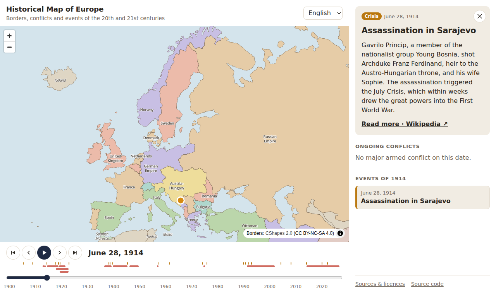

# History Map · Mapa històric d'Europa

An open-source interactive map of **Europe in the 20th and 21st centuries**. Move through time
and watch borders change, see which conflicts were being fought, and learn about the events that
shaped the continent.

> **Català:** Mapa interactiu i de codi obert d'Europa als segles XX i XXI. Navega pels anys, mira
> com canvien les fronteres i els estats, quins conflictes hi havia i aprèn sobre els fets
> històrics. La interfície està en català, castellà i anglès.



## Features

- 🗺️ **Borders on any date from 1900 to today**, with the name each state had at the time
  (Russian Empire → Soviet Russia → Soviet Union → Russia…), and colonies, protectorates and
  occupied territories distinguished from independent states.
- 🏳️ **Flags through history**: every state shows the flag it flew on the selected date, on the
  map and in a gallery; each state's card lists all its flags over time, and the gallery shows
  which states adopted a new flag each year.
- ⏱️ **Timeline** with month-by-month navigation, playback, and jumps between key dates.
- ⚔️ **Conflicts** active on the selected date, shown on the map and as bars on the timeline.
- 📜 **Historical events** of each year, with a short explanation and links to read more.
- 🌍 **Multilingual**: Catalan, Spanish and English (UI and content).
- 🔗 **Shareable links**: the URL keeps the date and language (`?d=1914-06-28&lang=ca`).

## Quick start

Requires Node.js 22+.

```bash
npm install
npm run dev        # http://localhost:5173
```

| Command                | What it does                                                   |
| ---------------------- | -------------------------------------------------------------- |
| `npm run dev`          | Development server with hot reload                             |
| `npm run build`        | Type-check and build the static site into `dist/`              |
| `npm test`             | Unit tests, including validation of every content file         |
| `npm run lint`         | Lint with oxlint                                               |
| `npm run format`       | Format with Prettier                                           |
| `npm run data:borders` | Rebuild `public/data/` from the CShapes 2.0 dataset (optional) |
| `npm run data:flags`   | Download the flags listed in `content/flags.yaml` (optional)   |

## How it works

The site is a static single-page app (React + TypeScript + Vite) that renders the map with
[MapLibre GL JS](https://maplibre.org/). Every border polygon carries its validity period, so
showing the map on a date is just a filter: `start <= date <= end`.

```
content/            ← historical content in YAML (events, conflicts, names, flags)
public/data/        ← border dataset generated by scripts/build-borders.mjs
public/flags/       ← flag images downloaded from Wikimedia Commons
src/                ← the web app
docs/               ← roadmap, architecture and data sources
```

See [docs/ARCHITECTURE.md](docs/ARCHITECTURE.md) for details and
[docs/ROADMAP.md](docs/ROADMAP.md) for where the project is heading.

## Contributing

Contributions are very welcome — especially **historical content**, which needs no programming:
adding an event is writing a small YAML file. Read [CONTRIBUTING.md](CONTRIBUTING.md) to get
started.

## Data sources and licences

- **Code**: [MIT](LICENSE).
- **Texts** in `content/`: [CC BY-SA 4.0](content/README.md).
- **Flags**: images from [Wikimedia Commons](https://commons.wikimedia.org/), mostly public
  domain; the licence of each one is in `public/flags/credits.json`.
- **Borders**: derived from [CShapes 2.0](https://icr.ethz.ch/data/cshapes/) (ETH Zürich,
  University of Konstanz), licensed CC BY-NC-SA 4.0 — **non-commercial use only**.

The map shows borders **settled by treaties**, not wartime occupations (for now). Read
[docs/DATA.md](docs/DATA.md) for every source, licence and known limitation.
