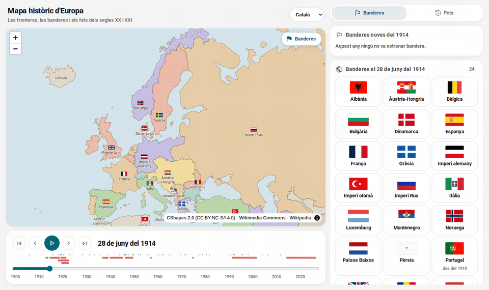
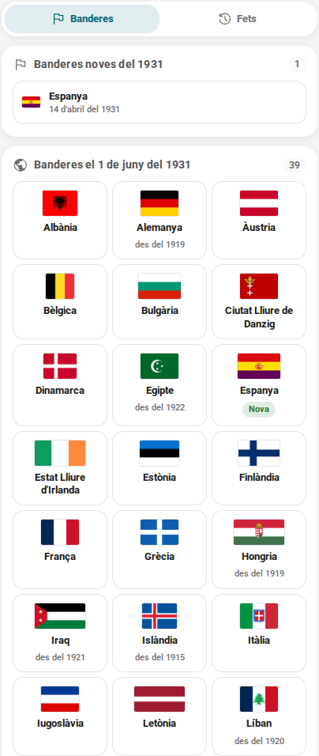
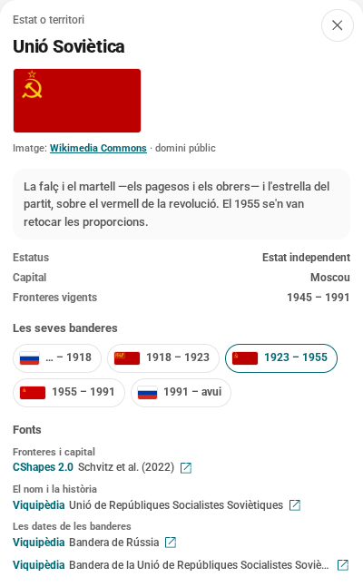
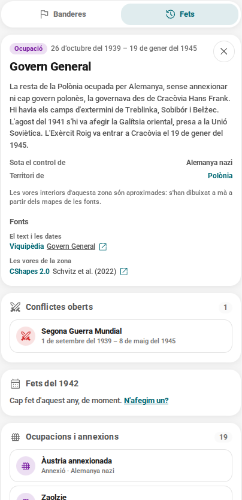
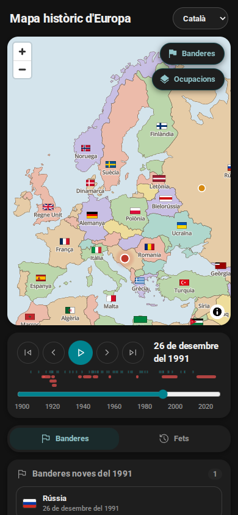
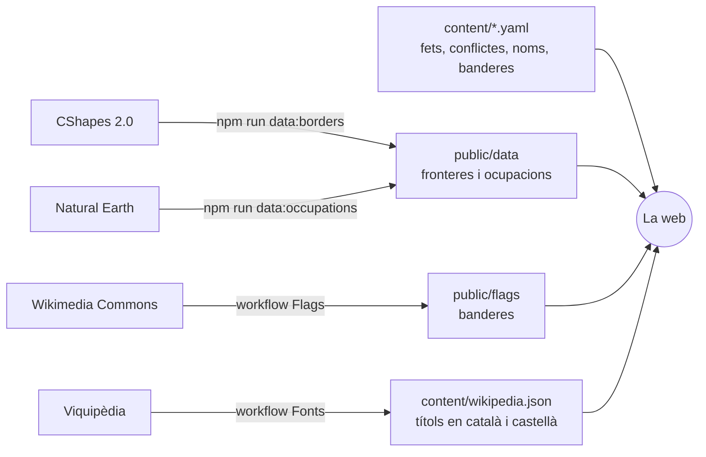

<div align="center">

# Mapa històric d'Europa

**Europa del 1886 a avui, en un mapa que es mou: les fronteres, les banderes i el que hi va passar.**

[Obre el mapa](https://arnaum13.github.io/history-map/?lang=ca) · [D'on surt la informació](DADES.md) · [Com s'hi contribueix](CONTRIBUTING.md) · [Full de ruta](FULL-DE-RUTA.md)

**Català** · [Castellano](README.es.md) · [English](README.en.md)

[](https://github.com/ArnauM13/history-map/actions/workflows/ci.yml)
[](https://github.com/ArnauM13/history-map/actions/workflows/sources.yml)
[](LICENSE)
[](content/README.md)
[](DADES.md)



</div>

Tries una data i el mapa et diu com era Europa aquell dia: quins estats hi havia i com es deien,
quina bandera feia servir cadascun, quines guerres estaven obertes i què va passar aquell any. I de
cada cosa, d'on surt.

La història d'Europa del segle XX s'acostuma a explicar amb quatre mapes —el del 1914, el del 1919,
el del 1945 i el del 1991— i el que passa entre l'un i l'altre s'ha d'imaginar. Entre el 1918 i el
1922, per exemple, el mapa canvia cada pocs mesos. Aquí es pot veure dia a dia.

## Què hi trobaràs

| | |
| --- | --- |
| **Les fronteres de qualsevol dia** | Del 1886 a avui, amb el dia exacte de cada canvi i el nom que tenia cada estat aleshores: l'Imperi Rus, la Rússia soviètica, la Unió Soviètica, Rússia. |
| **Cada bandera al seu temps** | Un centenar de banderes d'una setantena d'estats: al mapa, en una galeria per a cada data i a la fitxa de cada estat, amb què volen dir les que tenen més història. |
| **El que passava alhora** | Els conflictes oberts i els fets de l'any, al costat del mapa i marcats a la línia temporal. |
| **Les ocupacions, del 1938 al 1945** | El que es controlava de fet i les fronteres no ensenyen: l'annexió d'Àustria, el Govern General, la França de Vichy. Ratllat del color de l'ocupant, cada zona amb la seva fitxa. |
| **La font de cada dada** | Cada fitxa diu d'on surten les fronteres, el nom, les dates de les banderes i els fets, amb l'enllaç per comprovar-ho. |
| **Tres idiomes** | Català, castellà i anglès: la interfície, els noms dels estats i de les capitals, els textos i els enllaços a la Viquipèdia. |
| **Un enllaç per a cada data** | `?d=1914-06-28&lang=ca` obre exactament el mateix mapa a qui el rebi. |

## Captures

<table>
  <tr>
    <td width="50%" valign="top">
      
      <p><b>Banderes.</b> Totes les que onejaven aquell dia, i les estrenades aquell any: el 1931, la de la Segona República.</p>
    </td>
    <td width="50%" valign="top">
      
      <p><b>La fitxa d'un estat.</b> La bandera i què vol dir, totes les que ha tingut i, a «Fonts», d'on surt cada dada.</p>
    </td>
  </tr>
  <tr>
    <td valign="top">
      
      <p><b>Fets, conflictes i ocupacions.</b> El que estava obert aquell dia, el que va passar aquell any i qui controlava cada territori: el 1942, el Govern General.</p>
    </td>
    <td valign="top">
      
      <p><b>Al mòbil i en fosc.</b> El mapa, la línia temporal i el panell, un sota l'altre.</p>
    </td>
  </tr>
</table>

## D'on surt la informació

Cap dada no hi entra sense font, i la font es veu a la fitxa on surt.

| Què es veu | D'on surt |
| --- | --- |
| Les fronteres i les capitals | [CShapes 2.0](https://icr.ethz.ch/data/cshapes/) (ETH Zuric i Universitat de Constança), amb el dia exacte de cada canvi del 1886 al 2019 |
| El nom de cada estat en cada època | Un article de la Viquipèdia per a cada nom |
| Les dates de les banderes | Els articles de la Viquipèdia sobre les banderes de cada estat |
| Les imatges de les banderes | [Wikimedia Commons](https://commons.wikimedia.org/), amb la llicència i l'autor de cadascuna |
| Els fets i els conflictes | La Viquipèdia i fonts externes, com la resolució 68/262 de l'ONU sobre Crimea |
| Les zones ocupades i annexionades | Les fronteres de CShapes d'altres anys, les divisions d'avui de [Natural Earth](https://www.naturalearthdata.com/) i línies dibuixades a mà, amb l'article de la Viquipèdia de cada zona |

Els tests no deixen entrar res sense font, i el workflow «Fonts» comprova cada dilluns que tots els
articles i enllaços encara existeixen. El detall, les correccions i les limitacions són a
[DADES.md](DADES.md).

## Què no fa (i és volgut)

- **No dibuixa els fronts, de moment.** La capa d'ocupacions diu qui controlava cada territori, no
  on eren els exèrcits. Iugoslàvia, Grècia i el front de l'Est encara hi falten.
- **No és una enciclopèdia.** Dues o tres frases i l'enllaç a la font; la resta hi és ben explicada.
- **No et demana res.** Ni compte, ni galetes, ni dades teves.
- **No es pot fer servir comercialment.** Les fronteres de CShapes són CC BY-NC-SA.

## Com funciona

Una web estàtica: React 19, TypeScript, Vite i [MapLibre GL](https://maplibre.org/). Sense
servidor ni base de dades. Cada peça de frontera porta el dia que comença i el que s'acaba, i
ensenyar el mapa d'un dia és un filtre: `inici <= dia <= final`.



El contingut és YAML que es llegeix i s'escriu a mà, i els tests el validen. Les dades externes
(fronteres, banderes, títols de la Viquipèdia) les baixen scripts, i a GitHub, workflows que en fan
un commit quan canvien.

## Posar-lo en marxa

Cal Node.js 22 o més nou.

```bash
git clone https://github.com/ArnauM13/history-map.git
cd history-map
npm install
npm run dev        # http://localhost:5173
```

| Ordre | Què fa |
| --- | --- |
| `npm run dev` | Servidor de desenvolupament |
| `npm run build` | Comprova els tipus i deixa la web a `dist/` |
| `npm test` | Els tests, que també validen tot el contingut i les seves fonts |
| `npm run lint` · `npm run format` | oxlint i Prettier |
| `npm run data:borders` | Torna a fer les fronteres a partir de CShapes 2.0 |
| `npm run data:occupations` | Torna a fer les zones de la capa d'ocupacions |
| `npm run data:flags` | Baixa les banderes de `content/flags.yaml` |
| `npm run data:sources` | Comprova les fonts i en tradueix els títols de la Viquipèdia |

## Estructura

```
content/        el contingut: fets, conflictes, ocupacions, noms d'estats i capitals, banderes (YAML)
public/data/    les fronteres i les zones ocupades, generades a partir de CShapes
public/flags/   les banderes, baixades de Wikimedia Commons
scripts/        els que generen o comproven les dades
src/            la web: el mapa, la línia temporal, el panell
```

Com està fet i les convencions, a [CLAUDE.md](CLAUDE.md); el disseny, a [DESIGN.md](DESIGN.md).

## Contribuir

El que més falta és contingut: fets, conflictes, dates de banderes. No cal saber programar: és un
fitxer YAML curt, i la font és obligatòria. A [CONTRIBUTING.md](CONTRIBUTING.md) hi ha com es fa, i
als *issues* hi ha plantilles per proposar un fet o avisar d'una frontera, un nom o una bandera
que no toca. S'hi pot escriure en català, castellà o anglès.

## El que ve

- **La resta de la capa d'ocupacions**: Iugoslàvia, Grècia i el front de l'Est, i els territoris en
  disputa d'avui.
- **Més contingut**: uns cent fets i una trentena de conflictes, amb fonts acadèmiques a més de la
  Viquipèdia.
- **Un cercador i històries guiades** que moguin el mapa pas a pas.

La resta, a [FULL-DE-RUTA.md](FULL-DE-RUTA.md).

## Llicències

| Què | Llicència |
| --- | --- |
| El codi | [MIT](LICENSE) |
| Els textos de `content/` | [CC BY-SA 4.0](content/README.md) |
| Les fronteres i les ocupacions de `public/data/` | CC BY-NC-SA 4.0, com CShapes 2.0: **només ús no comercial** |
| Les banderes de `public/flags/` | La de cada imatge, quasi totes de domini públic (`credits.json`) |
| Les lletres i les icones | Open Sans i Material Symbols (Apache 2.0), Roboto (OFL 1.1) |

## Agraïments

- Guy Schvitz, Luc Girardin, Seraina Rüegger, Nils B. Weidmann, Lars-Erik Cederman i Kristian
  Skrede Gleditsch, per [CShapes 2.0](https://icr.ethz.ch/data/cshapes/).
- Qui dibuixa les banderes de Wikimedia Commons i qui escriu la Viquipèdia, en tots els idiomes.
- [Natural Earth](https://www.naturalearthdata.com/), per les divisions administratives.
- [MapLibre](https://maplibre.org/), [OpenMapTiles](https://github.com/openmaptiles/fonts),
  [Fontsource](https://fontsource.org/) i [Material Symbols](https://fonts.google.com/icons).
- El llenguatge visual és el de Petja.
