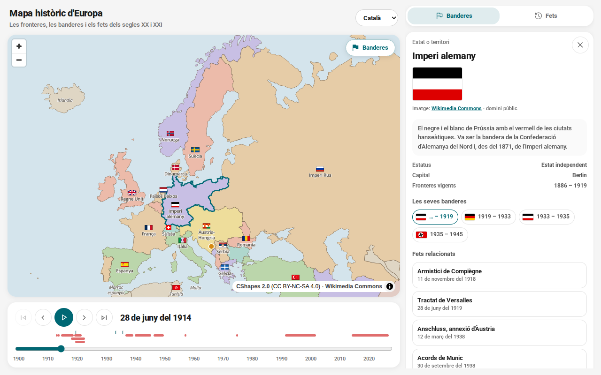

# Mapa històric d'Europa

**Català** · [Castellano](README.es.md) · [English](README.en.md)

**Europa del 1900 a avui, en un mapa que es mou: les fronteres, les banderes i el que hi va
passar.**

Tries una data i el mapa et diu com era Europa aquell dia: quins estats hi havia i com es deien,
quina bandera feia servir cadascun, quines guerres estaven obertes i què va passar aquell any.



---

## 1. El problema

La història d'Europa del segle XX s'acostuma a explicar amb quatre mapes —el del 1914, el del
1919, el del 1945 i el del 1991— i el que passa entre l'un i l'altre s'ha d'imaginar.

- **Fotos soltes.** Entre el 1918 i el 1922 Europa canvia cada pocs mesos. Quatre mapes no ho
  expliquen; un mapa que es mou, sí.
- **Tot per separat.** Un article per a cada estat, un altre per a cada guerra i un altre per a
  cada bandera. El que passava alhora no es veu mai junt.
- **Noms que canvien.** L'Imperi Rus, la Rússia soviètica, la Unió Soviètica i Rússia ocupen el
  mateix lloc del mapa. Si no t'ho diu ningú, sembla que siguin quatre països.

## 2. La proposta

| | |
| --- | --- |
| **Qualsevol dia** | Les fronteres de qualsevol data del 1900 a avui, amb el dia exacte de cada canvi. |
| **Cada bandera al seu temps** | Cada estat porta la bandera que tenia aquell dia, i la seva fitxa les ensenya totes. |
| **El que passava alhora** | Els conflictes oberts i els fets de l'any, al costat del mapa i a la línia temporal. |
| **Res sense font** | Cada frontera i cada bandera diu d'on surt i amb quina llicència. |

## 3. Per a qui és

- **Qui s'estima la història.** Vol veure com es desfà Àustria-Hongria mes a mes, o quan va
  canviar de bandera Espanya i per què.
- **Docents i estudiants.** Necessiten un mapa que es pugui moure a classe i un enllaç que obri
  exactament la data que expliquen.
- **Qui col·lecciona banderes.** Hi troba la cronologia de les banderes d'Europa, amb la imatge,
  la data i la font.

---

## 4. Què fa

### 4.1 El mapa — Europa en una data

Les fronteres vigents aquell dia, amb el nom que tenia cada estat en aquell moment. Les colònies,
els protectorats i els territoris ocupats es distingeixen dels estats independents. Si cliques un
estat, se n'obre la fitxa.

### 4.2 La línia temporal — un segle, mes a mes

Es mou mes a mes, es reprodueix sola (un segle en uns tres minuts) i salta d'una data clau a la
següent. A sota hi ha els conflictes, en barres, i les marques dels fets o dels canvis de bandera,
segons la pestanya que tinguis oberta.

### 4.3 Banderes — totes, i quan van canviar

Al mapa, cada estat porta la seva bandera al costat del nom. A la pestanya Banderes hi ha totes
les que onejaven aquell dia i les que es van estrenar aquell any. La fitxa d'un estat ensenya
totes les que ha tingut, i en tria una: anar-hi és saltar a la data en què va arribar. Les que
tenen més història porten dues frases que expliquen què volen dir i per què van canviar.

### 4.4 Fets i conflictes — què va passar

Els conflictes oberts en la data i els fets de l'any, cadascun amb dues o tres frases i l'enllaç a
la Viquipèdia, en el teu idioma, per seguir llegint.

### 4.5 Tres idiomes i un enllaç

Català, castellà i anglès: la interfície, els noms dels estats i de les capitals, els fets, els
conflictes i els textos de les banderes. L'adreça porta la data i l'idioma (`?d=1914-06-28&lang=ca`):
qui la rep obre el mateix mapa.

## 5. Principis

1. **La data mana.** El que es veu —fronteres, noms, banderes, conflictes— és el d'aquell dia, no
   el d'avui.
2. **Res sense font.** Cada fet enllaça a on es pot comprovar, i cada imatge diu d'on surt.
3. **Neutral i curt.** Dues o tres frases que expliquen; el debat, a les fonts.
4. **El contingut és de tothom.** Afegir un fet o corregir una bandera és editar un fitxer de
   text, sense programar.
5. **Una web estàtica.** Sense servidor, sense comptes, sense res a mantenir que no sigui el
   contingut.

## 6. Què no fa (i és volgut)

- **No és una enciclopèdia.** Dues o tres frases i l'enllaç a la Viquipèdia; la resta hi és ben
  explicada.
- **No dibuixa ocupacions ni fronts, de moment.** Les fronteres són les dels tractats. Entre el
  1938 i el 1945, Àustria i Polònia hi segueixen sortint (vegeu [DADES.md](DADES.md)). La capa
  d'ocupacions és al [full de ruta](FULL-DE-RUTA.md).
- **No et demana res.** Ni compte, ni galetes, ni dades teves.
- **No es pot fer servir comercialment.** Les fronteres de CShapes són CC BY-NC-SA.

---

## 7. Com s'executa

Cal Node.js 22 o més nou.

```bash
npm install
npm run dev        # http://localhost:5173
```

| Ordre | Què fa |
| --- | --- |
| `npm run dev` | Servidor de desenvolupament |
| `npm run build` | Comprova els tipus i deixa la web a `dist/` |
| `npm test` | Tests, que també validen tots els fitxers de contingut |
| `npm run lint` | oxlint |
| `npm run format` | Prettier |
| `npm run data:borders` | Torna a fer `public/data/` a partir de CShapes 2.0 |
| `npm run data:flags` | Baixa les banderes de `content/flags.yaml` |
| `npm run data:wikipedia` | Completa els enllaços a la Viquipèdia en català i castellà |

## 8. Com s'hi contribueix

El que més falta és contingut: fets, conflictes, dates de banderes. No cal saber programar; és un
fitxer YAML curt. A [CONTRIBUTING.md](CONTRIBUTING.md) hi ha com es fa.

## 9. Llicències

- **El codi**: [MIT](LICENSE).
- **Els textos** de `content/`: [CC BY-SA 4.0](content/README.md).
- **Les banderes**: imatges de [Wikimedia Commons](https://commons.wikimedia.org/), quasi totes de
  domini públic; la de cadascuna és a `public/flags/credits.json` i a l'app, sota la bandera.
- **Les fronteres**: derivades de [CShapes 2.0](https://icr.ethz.ch/data/cshapes/) (ETH Zuric i
  Universitat de Constança), CC BY-NC-SA 4.0: **només ús no comercial**.

---

*La resta de documentació: el disseny a [DESIGN.md](DESIGN.md), les fonts i les limitacions de
les dades a [DADES.md](DADES.md), el que ve a [FULL-DE-RUTA.md](FULL-DE-RUTA.md) i les convencions
del codi a [CLAUDE.md](CLAUDE.md). El README, CONTRIBUTING i DADES són als tres idiomes; la resta,
en català.*
